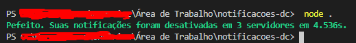

# Desativar Notificações 

Script que desabilita notificações para cada um dos seus servidores e os define como "NADA".

## Instalando

* `config.json` coloque o seu token.
* Instale os módulos usando `yarn install --prod`
* Inicie o projeto abrindo o `run.bat`.
